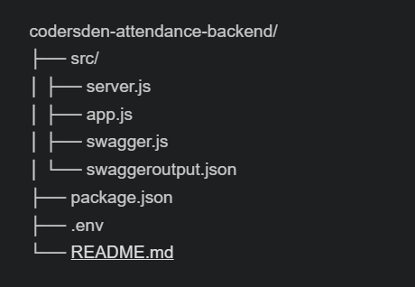

# Attendance Tracker Backend

This project is a Node.js Express backend with MongoDB, set up for handling API routes and Swagger documentation for the coders-den google meet attendance app

### Base Project Structure

<!--  -->

codersden-attendance-backend-starter/
├── src
│ ├── server.js
│ ├── app.js
│ ├── swagger.js
│ ├── swaggeroutput.json
├── package.json
├── .env
└── README.md

### Features

- Node.js and Express.js for the server
- MongoDB for the database
- Mongoose for object data modeling (ODM)
- Swagger for API documentation
- dotenv for managing environment variables

### Prerequisites

- Node.js (v14.x or higher recommended)
- npm (v6.x or higher)
- MongoDB Atlas account or a local MongoDB instance

## Getting Started

### Installation

**Clone the repository:**

```bash
git clone https://github.com/DT-GAMER/codersden-attendance-backend.git
cd codersden-attendance-backend
```

**Install dependencies:**

```bash
npm install
```

**Set up environment variables:**
Create a .env file in the root directory and add your MongoDB URI and other necessary environment variables:
`DB_URI = database_URI`
`PORT=3000`

**Running the Project**
Start the server with nodemon:

```bash
npm run dev
```

**Access the server:**
Open your browser and go to http://localhost:3000

**Access Swagger documentation:**
Open your browser and go to http://localhost:3000/api-docs
